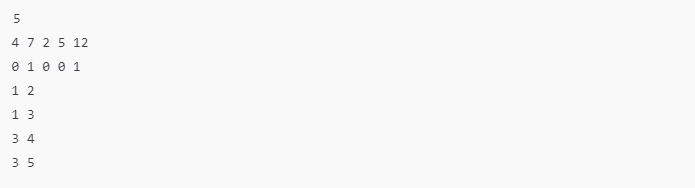
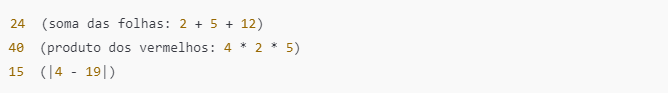

# Desafio de código com o padrão de projeto Visitor

No problema proposto deve-se usar o Padrão de Projeto Visitor (Visitor Design Pattern) no contexto de árvores (estruturas de dados).

### Objetivo
Implementar visitantes (visitors) para uma árvore, respeitando o princípio do aberto/fechado (Open/Closed Principle) da programação orientada a objetos. Isso significa que a funcionalidade deve ser estendida sem modificar diretamente a implementação da árvore

Você deve criar:
1. Três classes de visitantes diferentes.
2. Um método para construir a árvore a partir da entrada fornecida.

### Definições Importantes
1. Árvore:
   * Uma árvore é uma estrutura hierárquica com nós conectados por arestas. Cada nó pode ter filhos ou ser uma folha (nó sem filhos).
   * A profundidade de um nó é o número de arestas entre ele e a raiz da árvore.
     
2. Princípio Aberto/Fechado:
   * O código da classe Tree não pode ser modificado diretamente. Em vez disso, devemos estender sua funcionalidade usando o padrão Visitor.
  
3. Visitor Pattern:
   * Permite que você defina operações em objetos de uma estrutura de forma desacoplada. No contexto, visitantes percorrem os nós da árvore para executar cálculos específicos.

### Divisão do Problema
- Parte 1: Implementar Três Visitantes
  1. SumInLeavesVisitor:
     * Retorna a soma dos valores nos nós folha da árvore.
  2. ProductRedNodesVisitor:
     * Retorna o produto dos valores dos nós vermelhos, incluindo folhas, módulo 10^9 + 7.
     * Observação: O produto de um conjunto vazio é 1.
  3. FancyVisitor:
     * Calcula a diferença absoluta entre:
        - A soma dos valores dos nós não folha em profundidade par.
        - A soma dos valores dos nós folha verdes.
      
- Parte 2: Construir a Árvore
  * Entrada:
    1. Número de nós.
    2. Valores dos nós.
    3. Cores dos nós (0 para vermelho e 1 para verde).
    4. Arestas conectando os nós.
   
  * Saída:
    1. Criação da árvore seguindo a estrutura fornecida.

### Exemplo
- Entrada:\
  

- Saída\
  
